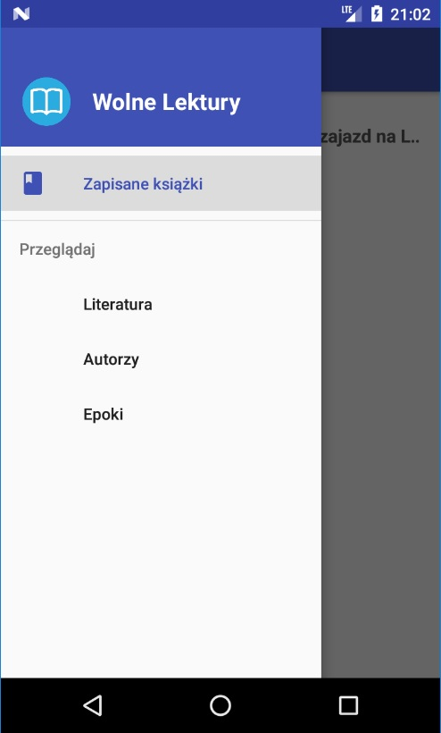

# WolneLektury Android

The application uses API wolnelektury.pl

Allows you to browse and read books online and in pdf format.

# Libraries this app uses:

1. Retrofit - https://github.com/square/retrofit
2. Glide Image Loading - https://github.com/bumptech/glide
3. RecyclerFastScroller - https://github.com/FutureMind/recycler-fast-scroll
4. ExpandableTextView - https://github.com/Manabu-GT/ExpandableTextView

# Screenshots

